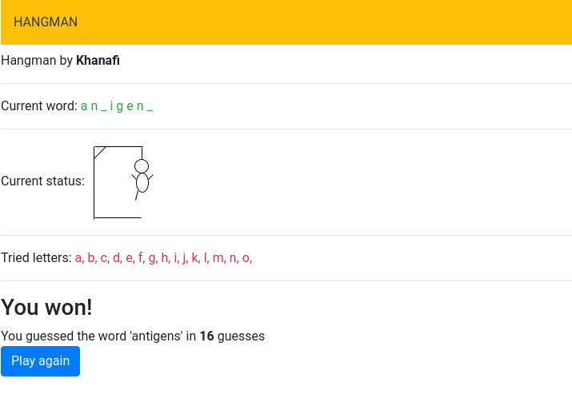

# hangman

Documentation
====================

This is project hangman using hangwords.txt 
using fopen 
using sessions 
test with a3.php 

change input txt file 
go to call.hangman.php 
$fp=fopen('hangwords.txt', 'r'); 

example 
https://localhost/sand/hangman/csc231/a3.php 

Demo: 
https://thekingofbandit.tilde.team/hangman/csc231/a3.php 

sources:
https://teamtreehouse.com/library/reading-files-into-a-string-or-array 
https://stackoverflow.com/questions/1372816/how-to-get-text-from-file-into-array-in-php 
